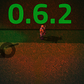

**[Notice](#notice)** |
**[Contributing](#contributing)** |
**[Credit](#credit)** |
**[Disclaimer](#disclaimer)** |
**[License](#license)**

---

<!-- <p align="center">
  
</p> -->

<p align="center">
  <a href="https://github.com/ZwerOxotnik/brush-tools/tags">
    
  </a>
  <a href="https://github.com/ZwerOxotnik/brush-tools/stargazers">
    
  </a>
  <a href="https://discordapp.com/invite/YyJVUCa">
    
  <br/>
  <a href="https://www.patreon.com/ZwerOxotnik">
    
  <a href="https://ko-fi.com/zweroxotnik">
    
  <a href="http://github.com/ZwerOxotnik/brush-tools/fork">
    
  </a>
</p>

<p align="center">
  <a href="changelog.txt">Changelog</a>
  ·
  <a href="https://crowdin.com/project/factorio-mods-localization">Translations</a>
</p>

<h1></h1>

<!--  -->

Brush tools **[ALPHA]**
-----------------------

[Demonstration video](https://www.youtube.com/watch?v=O0utdTVAW8A)

<p align="center">
  <a href="https://mods.factorio.com/mod/brush-tools/downloads"><strong>Download the mod&nbsp;&nbsp;▶</strong></a>
</p>

‼️ Important Links (Translations, Discord Support)
---------------------------------------------------------------

| Installation Guide | Translations | Discord |
| ------------------ | ------------ | ------- |
| 📖 [Installation Guide](https://wiki.factorio.com/index.php?title=Installing_Mods) | 📚 [Help with translations](https://crowdin.com/project/factorio-mods-localization) | 🦜 [Discord](https://discord.gg/zYTM3rZM4T) |

If you want to download from this source, then use commands below (requires [git](https://git-scm.com/downloads)).

```bash
git clone --recurse-submodules -j8 https://github.com/ZwerOxotnik/brush-tools
cd brush-tools
```

[Contributing](/CONTRIBUTING.md)
--------------------------------

Don't be afraid to contribute! We have many, many things you can do to help out. If you're trying to contribute but stuck, tag @ZwerOxotnik

Alternatively, join the [Discord group](https://discordapp.com/invite/YyJVUCa) and send a message there.

Please read the [contributing file](/CONTRIBUTING.md) for other details on how to contribute.

Credit
------

Some icons from flaticon.com:

* [Paint bucket](https://www.flaticon.com/free-icon/paint-bucket_483918)
* [Pen](https://www.flaticon.com/free-icon/pen_1250925)
* [Light bulb](https://www.flaticon.com/free-icon/lightbulb_702797) (Modified by ZwerOxotnik)

Disclaimer
----------

THE WORK IS PROVIDED "AS IS", WITHOUT WARRANTY OF ANY KIND, EXPRESS OR IMPLIED, INCLUDING BUT NOT LIMITED TO THE WARRANTIES OF MERCHANTABILITY, FITNESS FOR A PARTICULAR PURPOSE AND NONINFRINGEMENT. IN NO EVENT SHALL THE AUTHORS OR COPYRIGHT HOLDERS BE LIABLE FOR ANY CLAIM, DAMAGES OR OTHER LIABILITY, WHETHER IN AN ACTION OF CONTRACT, TORT OR OTHERWISE, ARISING FROM, OUT OF OR IN CONNECTION WITH THE WORK OR THE USE OR OTHER DEALINGS IN THE WORK.

License
-------

Copyright (c) 2021-2022, 2024-2025 **[ZwerOxotnik](https://github.com/ZwerOxotnik)**
